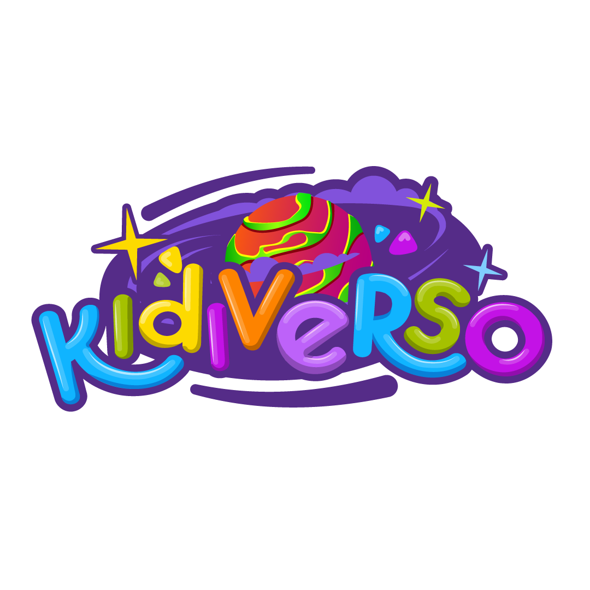

# Kidiverso Design System

> Leer este archivo antes de generar cualquier código, diseño o contenido para Kidiverso.
> Todos los valores están alineados con la identidad de marca oficial (v1.0 · Marzo 2026).

---

## Sobre Kidiverso

Kidiverso es un parque infantil temático espacial/galáctico ubicado en San Luis Potosí, México.
Dirigido a niños de 1 a 12 años y sus familias. El universo de marca gira en torno a la
exploración espacial, planetas, naves y criaturas alienígenas amigables.

**Ubicación:** Carretera a Guadalajara 1235, Lomas del Tecnológico, 78215 San Luis, S.L.P.
**Web:** kidiverso.mx
**Contacto:** hola@kidiverso.mx · Tel: 444 860 67 59 · WhatsApp: 440 186 4030
**Horarios:** Mar–Vie 1:00–8:00 PM · Sáb–Dom 2:00–8:00 PM · Lunes: exclusivo fiestas

---

## Tono y Voz de Marca

| Atributo | Descripción |
|----------|-------------|
| Personalidad | Divertido, aventurero, cálido, seguro |
| Tono | Entusiasta pero no infantilizado. Habla a los papás con cercanía y a los niños con emoción |
| Vocabulario temático | Misión, galaxia, explorador, tripulación, despegue, órbita, astronauta, universo, aventura |
| Evitar | Lenguaje aburrido/corporativo, diminutivos excesivos, tono condescendiente |

**Ejemplos de copy on-brand:**
- "¡Prepárate para el despegue!" (CTA)
- "Nuestra misión es tu aventura"
- "Cada rincón de Kidiverso es una nueva galaxia por descubrir"
- "Control de Misión listo para ayudarte" (soporte)

**Naming de áreas del parque:**
- Laberinto Cósmico (resbaladillas)
- Constelación de Brincolines y Trampolines
- Pared de Escalada
- Nebulosa de Inflables (jardín)
- Alberca de Asteroides (pelotas)
- Estación Creativa (Lego y Pintura)
- Canchas de Fútbol en el Jardín Sideral
- Zona para Pequeños Astronautas (área de bebés)
- Restaurante Pizza Planeta

---

## Fuentes

| Rol | Fuente | Notas |
|-----|--------|-------|
| Display / Títulos | Fredoka | Redondeada, divertida, muy on-brand |
| Body / UI | Nunito | Legible, cálida, complementa a Fredoka |

```html
<link href="https://fonts.googleapis.com/css2?family=Fredoka:wght@400;500;600;700&family=Nunito:wght@400;600;700;800;900&display=swap" rel="stylesheet">
```

---

## Colores de Marca

### Paleta Principal

| Nombre | Hex | Uso |
|--------|-----|-----|
| Purple | `#341C77` | Color primario, fondos hero, headers, nav |
| Purple Mid | `#5B3FA0` | Gradientes, acentos, hover states |
| Purple Light | `#8B6EC7` | Bordes activos, badges, fondos suaves |
| Purple Pale | `#F0EBFF` | Fondos claros, cards en tema light |
| Cyan | `#6EC1E4` | Acentos informativos, links, chips |
| Cyan Light | `#C2E8F7` | Fondos informativos, badges light |
| Green | `#61CE70` | Éxito, confirmación, WhatsApp CTAs |
| Green Light | `#D4F5D8` | Fondos de éxito |
| Orange | `#FFBC7D` | Acentos cálidos, texto destacado en hero |
| Orange Dark | `#F97316` | CTAs principales, botones de acción |
| Pink | `#E91E8C` | Acentos vibrantes, botones secundarios, badges |
| Pink Light | `#F1BDED` | Fondos suaves pink |

### Colores Semánticos

```css
:root {
  /* Marca */
  --purple:       #341C77;
  --purple-mid:   #5B3FA0;
  --purple-light: #8B6EC7;
  --purple-pale:  #F0EBFF;
  --cyan:         #6EC1E4;
  --cyan-light:   #C2E8F7;
  --green:        #61CE70;
  --green-light:  #D4F5D8;
  --orange:       #FFBC7D;
  --orange-dark:  #F97316;
  --pink:         #E91E8C;
  --pink-light:   #F1BDED;

  /* UI */
  --white:        #FFFFFF;
  --gray-bg:      #F7F5FF;
  --gray-text:    #5A5270;
  --gray-light:   #E8E4F4;
  --dark:         #1E1135;

  /* Gradientes frecuentes */
  --gradient-hero:    linear-gradient(135deg, #341C77 0%, #5B2D8E 50%, #E91E8C 100%);
  --gradient-cta:     linear-gradient(135deg, #FBBF24 0%, #F97316 100%);
  --gradient-space:   linear-gradient(175deg, #1A0A3E 0%, #2D1854 30%, #5B2D8E 60%, #E91E8C 100%);
}
```

### Reglas de Color

- **Tema dark (hero, secciones destacadas):** fondo con `--gradient-hero` o `--gradient-space`, texto blanco
- **Tema light (contenido, formularios, FAQ):** fondo `--white` o `--gray-bg`, texto `--dark`
- **CTAs primarios:** fondo `--gradient-cta` (amarillo→naranja), texto `--purple` (oscuro)
- **CTAs WhatsApp:** fondo `#25D366`, texto blanco
- **Links:** `--cyan` sobre fondos oscuros, `--purple` sobre fondos claros
- **Errores:** `--pink` para bordes y texto de error

---

## Tipografía

| Elemento | Font | Size | Weight | Color (light) | Color (dark) |
|----------|------|------|--------|----------------|--------------|
| H1 | Fredoka | clamp(2.2rem, 6vw, 3.8rem) | 700 | --dark | white |
| H2 / Section Title | Fredoka | clamp(1.6rem, 4vw, 2.5rem) | 700 | --dark | white |
| H3 / Card Title | Fredoka | 1.1rem | 600 | --purple | --orange |
| Body | Nunito | 1rem (16px) | 400 | --gray-text | rgba(255,255,255,0.8) |
| Small / Labels | Nunito | 0.85rem | 700 | --gray-text | rgba(255,255,255,0.6) |
| Badge / Chip | Nunito | 0.82–0.9rem | 800 | white | white |

---

## Spacing & Layout

```css
--sp-1:  4px;    --sp-2:  8px;    --sp-3:  12px;
--sp-4:  16px;   --sp-5:  20px;   --sp-6:  24px;
--sp-8:  32px;   --sp-10: 40px;   --sp-12: 48px;
```

- **Max-width contenido:** 900px–1100px
- **Padding secciones:** 3rem–4rem vertical, 1.5rem horizontal
- **Gap en grids:** 1.5rem

---

## Border Radius

```css
--radius-sm:    12px;   /* Inputs, small cards */
--radius-md:    16px;   /* Cards, panels */
--radius-lg:    20px;   /* Cards grandes, containers */
--radius-xl:    28px;   /* Form containers, hero elements */
--radius-full:  50px;   /* Botones, badges, chips, pills */
```

> Kidiverso usa radios generosos y redondeados — nada tiene esquinas duras.

---

## Sombras

```css
--shadow-card:  0 4px 16px rgba(52, 28, 119, 0.06);
--shadow-btn:   0 6px 25px rgba(249, 115, 22, 0.35);
--shadow-hover: 0 10px 35px rgba(0, 0, 0, 0.15);
--shadow-glow:  0 0 40px rgba(110, 193, 228, 0.3);
```

---

## Componentes

### Botones

**Tipografía:** Fredoka, 700, 1rem–1.2rem
**Padding:** 0.9rem 2.5rem
**Border-radius:** 50–60px (pill shape)
**Transición:** all 0.25s ease
**Hover:** translateY(-3px) + shadow más intenso

| Variante | Fondo | Color | Sombra |
|----------|-------|-------|--------|
| Primary (CTA) | `--gradient-cta` | `--purple` | `--shadow-btn` |
| Primary White | white | `--purple` | `--shadow-hover` |
| WhatsApp | `#25D366` | white | `0 6px 25px rgba(37,211,102,0.35)` |
| Pink / Secondary | `--pink` | white | `0 4px 14px rgba(233,30,140,0.3)` |
| Ghost | rgba(255,255,255,0.15) | white | none, border 1px solid rgba(255,255,255,0.3) |

### Inputs (Formularios)

```css
padding: 0.75rem 1rem;
border: 2px solid var(--gray-light);
border-radius: 14px;
background: white;  /* o rgba(45,24,84,0.5) en tema dark */
font-family: 'Nunito', sans-serif;
font-size: 0.95rem;
transition: all 0.3s ease;

/* Focus */
border-color: var(--cyan);
box-shadow: 0 0 0 3px rgba(110,193,228,0.15);

/* Error */
border-color: var(--pink);
```

### Cards

```css
background: white;  /* o glass: rgba(91,45,142,0.4) + backdrop-filter: blur(10px) */
border: 1px solid var(--gray-light);
border-radius: var(--radius-lg);  /* 20px */
padding: 1.5rem–2rem;
box-shadow: var(--shadow-card);
transition: all 0.3s ease;

/* Hover */
transform: translateY(-5px);
box-shadow: var(--shadow-hover);
```

### Badges / Chips

```css
display: inline-block;
padding: 0.35rem 1rem;
border-radius: 50px;
font-size: 0.85rem;
font-weight: 700–800;
letter-spacing: 0.3px;
/* Sobre dark: */ background: rgba(255,255,255,0.15); border: 1px solid rgba(255,255,255,0.3); backdrop-filter: blur(6px);
/* Sobre light: */ background: var(--purple-pale); color: var(--purple);
```

---

## Personajes de Kidiverso

Kidiverso tiene 6 personajes + 1 mascota principal + 1 nave. Todos son PNG con fondo
transparente. Los archivos están en el directorio `assets/` de esta skill.

| Personaje | Archivo | Descripción | Uso sugerido |
|-----------|---------|-------------|--------------|
| **Astro Kid** | `Astro_Kid.png` | Niño astronauta con traje blanco/naranja y casco. Mascota principal de Kidiverso | Hero sections, materiales principales, branding general |
| **Lyra** | `Lyra.png` | Monstruo naranja con 3 ojos púrpura, amigable y baboso | Sección de comida/restaurante, diversión, energía |
| **Nova** | `Nova.png` | Bolita rosa/fucsia peluda con lentes y patitas | Sección creativa/arte, zona de lectura, educación |
| **Onix** | `Onix.png` | Gato púrpura con manchas naranja/rosa y cola de fuego | Sección de actividades físicas, aventura, deportes |
| **Orbit** | `Orbit.png` | Alien azul en platillo volador con luces | Tecnología, datos, formularios, countdown |
| **Pax** | `Pax.png` | Monstruo verde limón con 1 ojo rosa y cuernos | FAQ, sorpresas, zona de inflables, preguntas |
| **Nave** | `NAVE.png` | Cohete/nave púrpura con ventana naranja | Navegación, loading states, transiciones, CTAs |

### Reglas de Uso de Personajes

1. **Nunca distorsionar** las proporciones de los personajes
2. **Tamaño mínimo:** 80px de alto para que se distingan bien
3. **Tamaño decorativo:** 100–200px, posicionados en esquinas o laterales
4. **Tamaño protagonista:** 200–400px cuando es el foco visual
5. **Siempre usar los PNG originales** — no recrear los personajes con CSS/SVG/emojis
6. **Máximo 2 personajes por sección** para no saturar
7. **Fondo:** Los PNG tienen fondo negro que debe removerse o usar con `mix-blend-mode` si el fondo es oscuro. Idealmente, solicitar versiones con fondo transparente
8. **Animaciones suaves permitidas:** float (sube/baja), scale en hover, rotate sutil. Nunca animaciones agresivas

### Asignación de Personajes por Contexto

| Contexto | Personaje Principal | Secundario |
|----------|-------------------|------------|
| Hero / Landing principal | Astro Kid | Nave |
| Fiestas / Eventos | Lyra | Pax |
| Campamento | Astro Kid | Onix |
| Restaurante Pizza Planeta | Lyra | — |
| Zona creativa / Arte | Nova | — |
| Deportes / Activación | Onix | Astro Kid |
| FAQ / Soporte | Pax | Orbit |
| Formularios / Inscripción | Orbit | — |
| Zona bebés | Nova | Pax |
| Ofertas / Promos | Pax | Lyra |
| Error / 404 | Orbit (perdido en el espacio) | — |

---

## Assets

Los assets gráficos de la marca se encuentran en:

```
kidiverso-design/
├── SKILL.md          (este archivo)
└── assets/
    ├── Astro_Kid.png
    ├── Lyra.png
    ├── Nova.png
    ├── Onix.png
    ├── Orbit.png
    ├── Pax.png
    ├── NAVE.png
    ├── logo-kidiverso-sin-fondo.png
    └── kidiverso-1.png  (ventana de nave / porthole)
```

**Logo principal:** `logo-kidiverso-sin-fondo.png` — letras coloridas con planeta. Fondo transparente.
**Porthole / ventana de nave:** `kidiverso-1.png` — marco circular púrpura con vidrio naranja, estilo ventana de nave espacial. Útil para enmarcar fotos o como decoración.

---

## Paquetes de Fiesta (referencia de producto)

Kidiverso maneja 3 niveles de fiesta:

| Paquete | Espacio | Capacidad | Horario |
|---------|---------|-----------|---------|
| Área Reservada | Espacio en parque abierto | 10–45 personas | 3–8 PM (Mar–Dom) |
| Salón Onix | Salón privado | Mín. 30 personas | 3–8 PM (Mar–Dom) |
| Fiesta Exclusiva | Parque completo privado | Hasta 150 personas | Mañanas fines de semana o Lunes tarde |

> Para precios y detalles completos, consultar el PDF de paquetes de eventos.

---

## Patterns de Código

### HTML/CSS Landing Page

```html
<!-- Estructura base de sección hero Kidiverso -->
<section class="hero" style="background: var(--gradient-hero); padding: 3rem 1.5rem; text-align: center;">
  
  <div class="badge">🐣 CAMPAMENTO DE PASCUA 2026</div>
  <h1 style="font-family: 'Fredoka', sans-serif;">¡Una semana de <span style="color: var(--orange);">pura diversión!</span></h1>
  <div class="chips">
    <span class="chip">📅 6 al 10 de abril</span>
    <span class="chip">🕘 9:00 a 14:00 hrs</span>
    <span class="chip">🧒 3 a 12 años</span>
  </div>
  <a href="#inscripcion" class="btn-primary">¡Quiero inscribirme!</a>
</section>
```

### Personaje decorativo flotante

```css
.character-float {
  position: absolute;
  width: 120px;
  height: auto;
  animation: float 3s ease-in-out infinite;
  pointer-events: none;
}
@keyframes float {
  0%, 100% { transform: translateY(0); }
  50% { transform: translateY(-15px); }
}
```

---

## CSS Variables — Bloque Completo para Copiar

```css
:root {
  /* Marca */
  --purple: #341C77;  --purple-mid: #5B3FA0;  --purple-light: #8B6EC7;
  --purple-pale: #F0EBFF;  --cyan: #6EC1E4;  --cyan-light: #C2E8F7;
  --green: #61CE70;  --green-light: #D4F5D8;
  --orange: #FFBC7D;  --orange-dark: #F97316;
  --pink: #E91E8C;  --pink-light: #F1BDED;

  /* UI */
  --white: #FFFFFF;  --gray-bg: #F7F5FF;
  --gray-text: #5A5270;  --gray-light: #E8E4F4;  --dark: #1E1135;

  /* Gradientes */
  --gradient-hero: linear-gradient(135deg, #341C77 0%, #5B2D8E 50%, #E91E8C 100%);
  --gradient-cta:  linear-gradient(135deg, #FBBF24 0%, #F97316 100%);
  --gradient-space: linear-gradient(175deg, #1A0A3E 0%, #2D1854 30%, #5B2D8E 60%, #E91E8C 100%);

  /* Spacing */
  --sp-1: 4px;  --sp-2: 8px;  --sp-3: 12px;  --sp-4: 16px;
  --sp-5: 20px; --sp-6: 24px; --sp-8: 32px;  --sp-10: 40px; --sp-12: 48px;

  /* Radius */
  --radius-sm: 12px;  --radius-md: 16px;  --radius-lg: 20px;
  --radius-xl: 28px;  --radius-full: 50px;

  /* Sombras */
  --shadow-card:  0 4px 16px rgba(52,28,119,0.06);
  --shadow-btn:   0 6px 25px rgba(249,115,22,0.35);
  --shadow-hover: 0 10px 35px rgba(0,0,0,0.15);
  --shadow-glow:  0 0 40px rgba(110,193,228,0.3);
}
```
